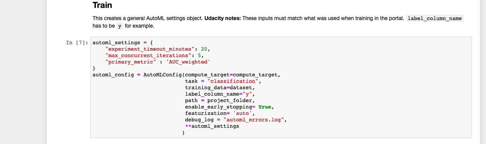
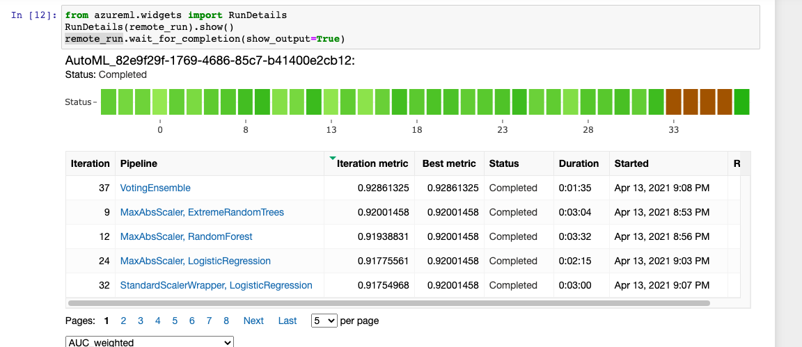
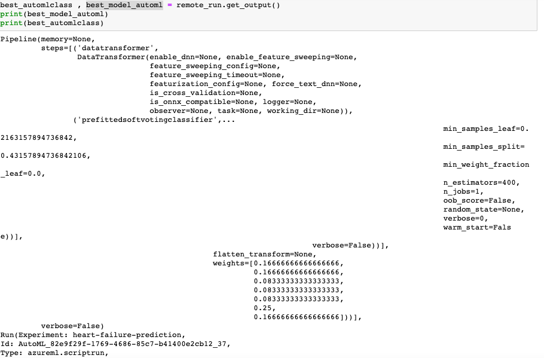
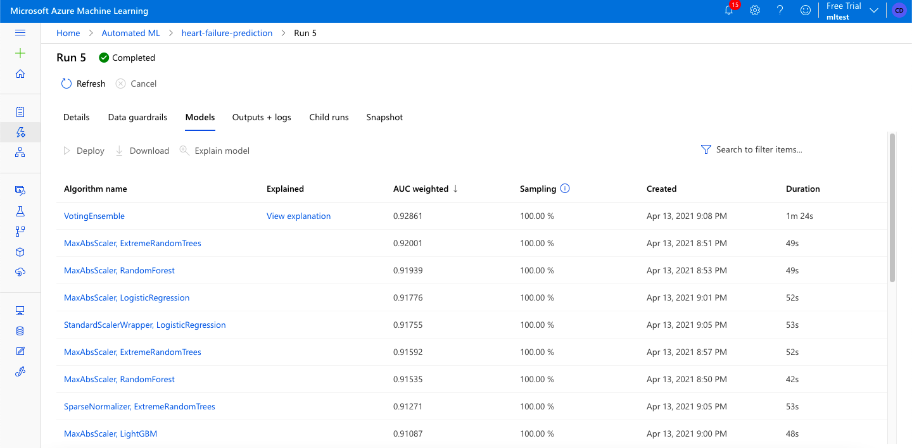
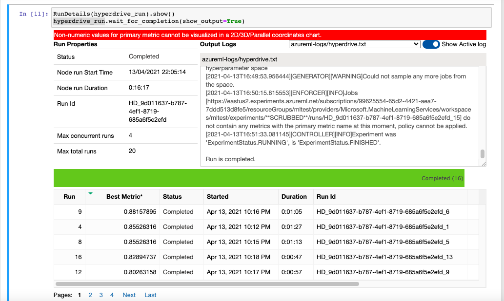
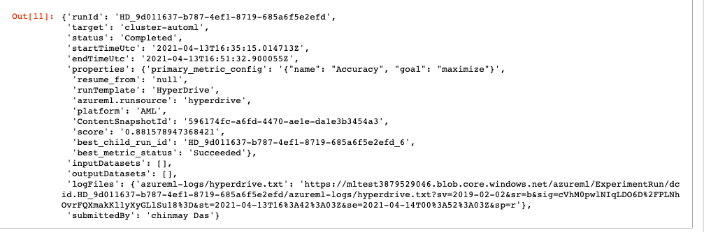
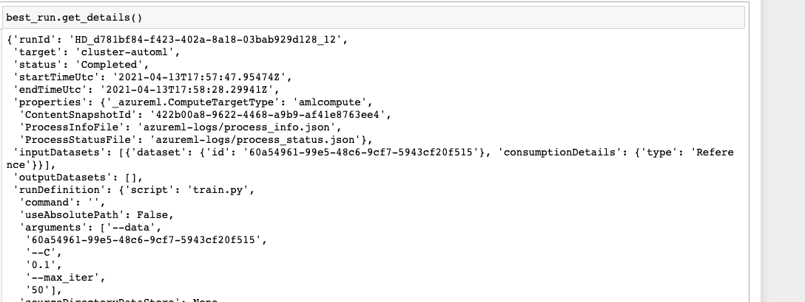
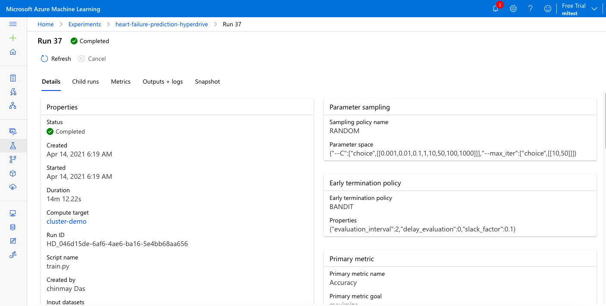
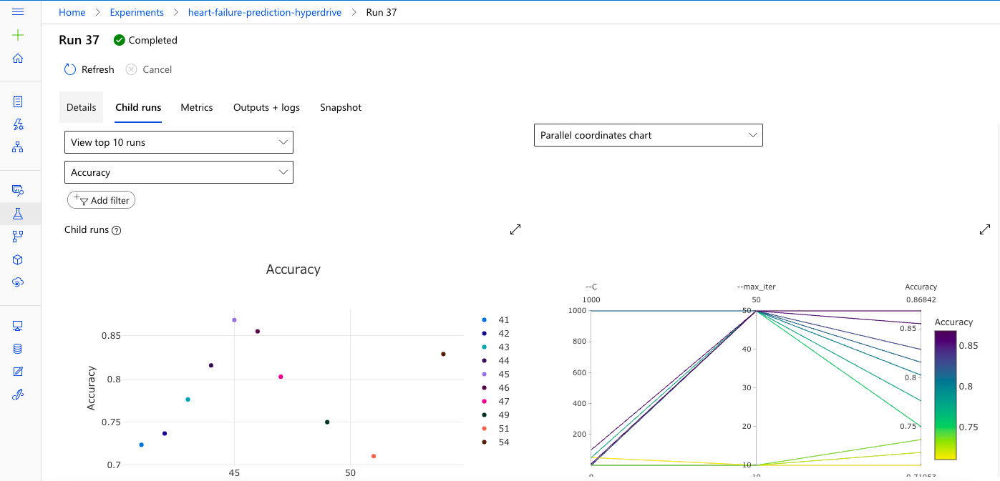

# Predict Heart Disease Using Azure Machine Learning

* This project is a part of Udacity Machine Learning Engineer with Microsoft Nanogree's Capstone project.

* In this project we will implement hyperdrive and AutoML for heart disease prediction dataset.

* We will deploy the model and do the inference with the sample json file for each model.

## Project Set Up and Installation

## Dataset

### Overview

* In this project we used kaggle's heart disease dataset.

* [Link](https://www.kaggle.com/andrewmvd/heart-failure-clinical-data)

* People with cardiovascular disease or who are at high cardiovascular risk (due to the presence of one or more risk factors such as hypertension, diabetes, hyperlipidaemia or already established disease) need early detection and management wherein a machine learning model can be of great help.

### Task

* This is a classification problem.

* Death due to Heart Failure is predicted using information such as anaemia, diabetes, high blood pressure, platelets, serum_creatinine, serum_sodium, creatinine_phosporous and ejection_fraction.

* We will use these features to predict if the patient has heart disease or not.

### Access

* I have uploaded the csv data into the azure ml dataset directory, from there I will directly use the dataset for hyperdrive and automl.

## Automated ML

* Azure machine learning studio has an AutoML functionality in which we can directly upload the dataset and it will run multiple model to get the best model with optimum metrics. 

* And the best model also can be deployed and consumed with restAPI.

* The following configuration is used here : 

	* experiment_timeout_minutes : the time in minutes after the experiment timeouts which is set to 20.
	* n_cross_validations the number of cross validations which is performed on the training data, set to 5
	* may_concurrent_iterations describes the maximal number of tasks solfed in parallel, here 5.
	* primary_metric the choosen metric - AUC_weighted

### Results

* The key benefit of AutoML is the variaty of different classification algorithems, their outputs are compared against eachother to find the best fitting model. Here the best fitted model is the VotingEnsemble, a detailed view shows the n_estimators=25, n_jobs=0 and the metrix of weights for more information to look into the model.

* Our model give 0.92861 AUC

---

* We can see that the optimized parameters are :

---

---

#### Improvement :

* To increase more data.
* To implement deep learning model.

## Hyperparameter Tuning

* AzureML supports hyperparameter tunig using hyperdrive package. Using hyperdrive, the parameter search space space can be defined using randon, grid or bayesian sampling. In the experiement, LogisticRegression classification was used. The training script loads the data, cleans that data, and runs LogisticRegression using the parameters supplied to the script and logs the metrics. The hyperdrive samples the paramters and calls the training script using a set of parameters at a time. Hyperdrive compares the metrics, and ranks the experiment runs based the specific metric. In this experiment, Accuracy was used to rank the runs.

* The first branch of the workflow project leads to receiving a trained model using AutoML. Settings and configurations used for this experiment are a BanditPolicy as an early termination policy, RandomParameterSampling of the tuneable hyperparameters of the classifier and the HyperDriveConfig.

### Results

* As it turned out with an accuracy of 0.8815 (even better than the runs before) the hyperparameter combination of the Regularization Strength of 0.1 and 50 Max iterations lead to the best tuned model.

* 

---

---

---

---

## Future Imporvement  

* We can try with different algorithm rather than logistic regression to get better accuracy.

* We can try different sampling methods.

* We can try different policy parameter with cross-validation.

## Model Deployment

* Automate ML model gives better result so we deployed the best run of AutoML.

* Provide a scoring script that will be invoked by the web service call (using scoring.py). The scoring script must have two required functions, init() and run(input_data).

* init(): Loading your model
* run():Running your model on input data

* Provide an environment file so that Azure Machine Learning can install the necessary packages in the Docker image which are required by your scoring script.

* Create InferenceConfig:

* An inference configuration describes how to set up the web-service containing your model. It's used later when you deploy the model.
Best run environment and score.py file is provided to the InferenceConfig. cpu_cores and memory_gb are initialized as 1 for the deployment configuration and deploy to Azure Container Instance(ACI).

## Screen Recording

- A working model
- Demo of the deployed  model
- Demo of a sample request sent to the endpoint and its response

